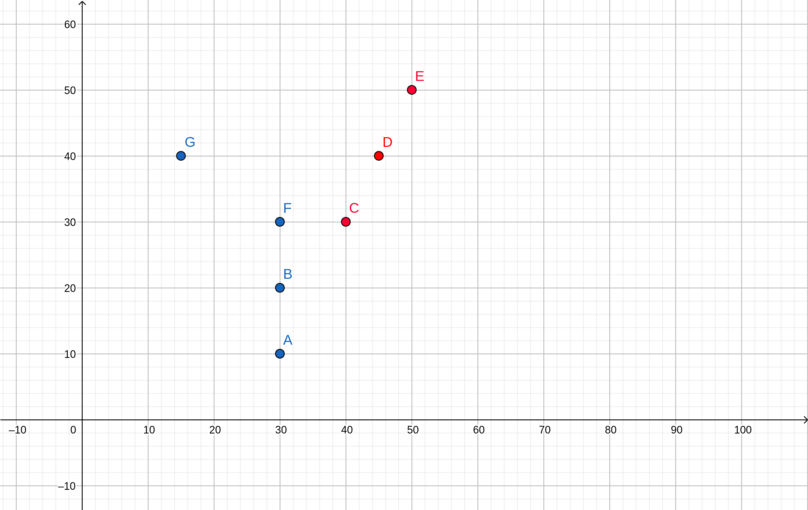

# Hipóteses e padrões

Antes de implementar qualquer algoritmo de machine learning, precisamos entender minimamente o que são hipóteses e como elas influenciam a busca por um padrão _bom_(?) de solução. Lembra do exemplo dos exames e da doença que demos aula passada? Vamos modificá-lo um pouco para podermos desenhar em 

Considere a seguinte tabela de dados:

|Exame 1| Exame 2| Doente? |
|-------|------- |---------|
| 30    | 10     | Não     |   
| 30    | 20     | Não     |   
| 40    | 30     | Sim     |
| 45    | 40     | Sim     |
| 50    | 50     | Sim     |
| 30    | 30     | Não     |
| 15    | 40     | Não     |

##### Como plotamos os dados?
Boa pergunta. A maneira mais convencional é considerar cada tipo de dado como uma dimensão. Ou seja, no caso acima, teríamos duas dimensões: Exame 1 e Exame 2. A classificação (Doente?) serve apenas para iteração do algoritmo, não costumamos plotá-lo para diminuir o grau de complexidade da visualização, afinal, estaríamos plotando uma dimensão a mais. Veremos que, apenas plotando os dados, conseguimos uma maneira inteligente de dividi-los sem precisar plotar sua devida classificação: faremos isso pintando eles de uma determinada cor. No caso acima, por exemplo, poderíamos pintar os saudáveis de azul e os doentes de vermelho.

  

Não se esqueça do nosso objetivo inicial: separar os doentes dos não doentes. Se você tivesse que escolher uma função, ou algum tipo de curva que os separasse, qual escolheria?

###### Ah, existem infinitas curvas que separam esses dados. A mais simples de todas é uma reta, mas eu quero uma parábola porque sim.

Tudo bem, vamos escolher alguma parábola que separe esses dados. Uma possível parábola que separa os dados é:
 

(A equação é irrelevante para o entendimento do que queremos, não se assuste)
  

Bom, você concorda comigo que poderíamos ter escolhido simplesmente uma reta?

###### Sim, é mais simples, mas quem garante que é melhor?

Olha, garantir eu não posso, mas tenho razões para te fazer acreditar que a chance de eu estar certo é maior que a sua. Mas, para formalizar isso, precisamos construir alguns conceitos.
  

#### Erro
Primeiramente, lembra da aula passada que eu disse que podemos ter algum erro dentro da amostra, e ainda sim não é o fim do mundo?

#### Peraí, peraí. Por que temos erro dentro da amostra se já sabemos previamente a classificação dos dados?

Excelente pergunta! Porque quem vai nos responder a classificação do dado é o algoritmo, nós apenas vamos programá-lo. Nós podemos arbitrariamente pegar os dados que ele classificou errado e mudar para obter erro 0 dentro da amostra, mas estaríamos fazendo com que ele *decorasse* esse dado, isto é, ele não seria fruto do resultado de um algoritmo de machine learning.  

Voltando, uma vez que rodamos nosso algoritmo de classificação, uma das coisas a serem avaliadas é a função erro. Há dois tipos de erro:

**1) Erro dentro da amostra**: denotado por , para calculá-lo no caso de um problema de classificação, contaremos quantos dados nosso algoritmo classificou errado. Para isso, basta iterar sobre todos os nossos dados, comparar a **classificação real** com a devolvida pelo nosso algoritmo e ver se são iguais. Em suma, 

**2) Erro fora da amostra**: denotado por , representa os dados que foram classficados incorretamente na tentativa de generalização. É **impossível** calculá-lo. Pensa comigo: se soubessemos como cálculá-lo, saberíamos mudar nossa classificação para correta, e _voilà_, sabemos classificar todos os dados do mundo corretamente.

#### Mas você não acabou de dizer que mudar a classificação manualmente é decorar?
Sim, mas há uma sutil diferença: no caso anterior estávamos dentro da amostra, e o motivo pelo qual decorar dentro da amostra é ruim porque diminui a chance de generalização, isto é, quando decoramos aumentamos . O único caso em que decorar seria bom é caso pudéssemos fazê-lo com todos os dados daquela situação, o que é completamente inviável.

 Em um problema de classificação, que é nosso caso, o erro é binário: ou eu acerto, ou eu erro. Mas veremos, mais para frente, que é possível definir outros tipos de erro.

#### Hipóteses
Mesmo que você não saiba me dizer qual a solução certa, você é capaz de me dizer a **família** de soluções que seu algoritmo devolve. Por exemplo, você me deu uma parábola como solução, ou seja, seu algoritmo tem como saída equações do segundo grau como soluções. Já o meu sempre devolve retas. Quais as diferenças básicas?

Antes de responder isso, vamos tentar formalizar um pouco o que é uma **hipótese**. Nosso algoritmo resolve um problema de classificação em diferentes **categorias**. Particularmente, no exemplo dado anteriormente as categorias são binárias: doente ou não doente. Existe uma função matemática  que separa **100% corretamente** todos os dados **fora e dentro da amostra**, porém ela é **desconhecida** e **inatingível**. O domínio dela é uma tupla contendo em cada coordenada um tipo de dado fornecido, por exemplo,  (por isso ) e seu contra-domínio devolve sua classificação, que em geral é um número inteiro, mas nada impede que seja real. Porém, não temos informação o suficiente para construí-la, portanto, o que fazemos com machine learning é tentar aprender um padrão, **encontrar uma hipótese que se aproxime o máximo possível da realidade**.

Agora que formalizamos, vamos voltar à pergunta inicial: quais as diferenças entre o seu algoritmo, que tem como saída equações do segundo grau, e o meu, que devolve do primeiro grau?
  
 O seu fornece soluções da forma , enquanto que o meu somente . Faça  na equação do segundo grau, obtemos  , que é essencialmente uma equação de reta, concorda? Isto significa que seu algoritmo também pode devolver retas como soluções, ou seja, o **conjunto de hipóteses do seu algoritmo engloba o do meu**.
  

##### Então, teoricamente, o meu é melhor, já que toda saída que o seu dá, o meu também poderia dar, certo?

Errado! Calma, você está está certo em dizer que o seu devolve tudo o que o meu poderia devolver e mais um pouco, porém errado ao dizer que é melhor por isso, **é justamente o contrário**. Nas próximas aulas provaremos isso, mas guarde isso com carinho: **quanto maior seu conjunto de hipóteses, menos chances temos de garantir que estamos certo**. Caso não tenha contato profundo ou nem mesmo superficial (principalmente se for esse o caso) com probabilidade e estatística, preste bastante atenção nisto: eu disse **chances** de estar certo. Sim, chances têm tudo a ver com probabilidades. Considere a seguinte fórmula, uma pequena variação da conhecida (nos campos da probabilidade) desigualdade de Hoeffding:
 

&nbsp;&nbsp;&nbsp;&nbsp;&nbsp;&nbsp;&nbsp;&nbsp;&nbsp; &nbsp;&nbsp;&nbsp;&nbsp;&nbsp;&nbsp;&nbsp;&nbsp;&nbsp;&nbsp;&nbsp;&nbsp;&nbsp;&nbsp;&nbsp;<a href="https://www.codecogs.com/eqnedit.php?latex=P[|E_i_n&space;-&space;E_o_u_t|>\varepsilon]&space;\leq&space;2Me^{-2\varepsilon^2N}" target="_blank">\varepsilon]&space;\leq&space;2Me^{-2\varepsilon^2N}" title="P[|E_i_n - E_o_u_t|>\varepsilon] \leq 2Me^{-2\varepsilon^2N}" /></a>

Calma, não se assuste, vou explicar cada detalhe dela, mas não vamos prová-la, pois exigiria uma boa carga de probabilidade e estatística envolvida, apenas vamos partir da desigualdade de Hoeffding original e mostrar como chegamos nessa variação acima, mas isso em aulas futuras.

Vamos definir o que cada parâmetro significa:

*  e 

  Como visto anteriormente, representam, respectivamente, os erros dentro e fora da amostra.

* 

  Representa a quantidade de dados que nós dispomos. No caso dos exames, temos 7 dados, portanto, N = 7

* 

  Representa o número de hipóteses do nosso modelo. Por enquanto ainda não sabemos calcular M para ambos os casos anteriores (parábola e reta), pois são infinitos. Mas, por enquanto, basta saber que o primeiro é maior que o segundo. Faremos uma análise puramente qualitativa desta desigualdade.

* 

  É a única variável dentre nossos parâmetros. Se você me der um , eu te dou uma probabilidade associada.

 
Agora, vamos analisar cada parte da fórmula:

* <a href="https://www.codecogs.com/eqnedit.php?latex=P[|E_i_n-E_o_u_t|>\varepsilon]" target="_blank">\varepsilon]" title="P[|E_i_n-E_o_u_t|>\varepsilon]" /></a>

  Estamos analisando o módulo da diferença entre o erro dentro e fora da amostra. Lembra que eu disse que era impossível calcular ? Essa é uma maneira de estimá-lo, já que estamos calculando a probabilidade de  estar tão próximo quanto eu queira, a depender da escolha de .

* 

  É o limite superior para a probabilidade, isto é, a chance de  ser maior que  é menor ou igual a esse cara aí em cima.

 

No mundo ideal, eu quero que a probabilidade de  estar muito próximo de  seja muito alta. Em outras palavras, quero que <a href="https://www.codecogs.com/eqnedit.php?latex=P[|E_i_n-E_o_u_t|>\varepsilon]" target="_blank">\varepsilon]" title="P[|E_i_n-E_o_u_t|>\varepsilon]" /></a> seja muito pequeno. Porém, repare que, quanto menor for a escolha de , menos eu consigo limitar, pois do lado direito temos uma exponencial negativa, isto é, quanto menor o , maior o valor, portanto, dá uma probabilidade alta dos erros estarem distantes, **o que não significa que, na prática, estão**.

Finalizando a ideia, lembra que eu disse que te daria algumas razões para acreditar que uma reta era uma escolha melhor do que uma parábola? Pois bem,  , portanto, <a href="https://www.codecogs.com/eqnedit.php?latex=P[|E_i_n-E_o_u_t|>\varepsilon]" target="_blank">\varepsilon]" title="P[|E_i_n-E_o_u_t|>\varepsilon]" /></a> é **menos limitado** pela desigualdade.
