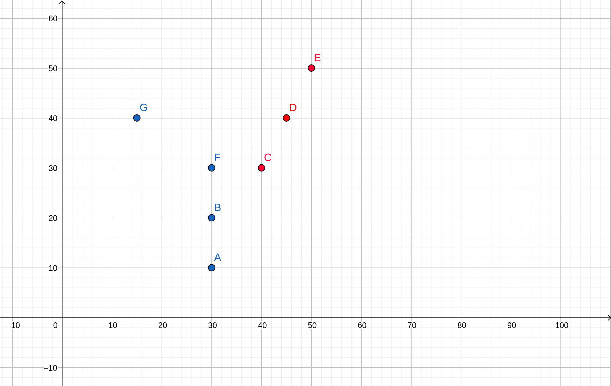

# Etapas de uma prática de Machine Learning

Agora que conhecemos alguns algoritmos de machine learning, vamos analisar, na prática, como usamos machine learning para resolver algum problema. Por enquanto, vamos nos conter a um problema fictício: classificar dados binariamente.

Vamos supor que dispomos de um grupo de pessoas para resolver este problema de classificação. Apesar de não haver uma separação clara entre as etapas de um procedimento de machine learning, bem como uma ordem entre elas, aqui será apresentada uma possível a ser utilizada. Nosso trabalho será dividido em 4 etapas:

### 1) Data Set
  É necessário que um grupo filtre e **padronize**
os dados a serem utilizados no algoritmo.

###### Mas por que? O Data Set já não é fornecido como entrada?
Sim, mas não vêm na forma de uma entrada de um algoritmo, eles vêm de uma forma **bruta** e precisamos deixá-lo **refinado**. Por exemplo, suponha o seguinte conjunto bruto de dados:

|Exame 1| Exame 2| Doente? |
|-------|-------|---------|
| 30    | 10    | Não     |   
| 30    | 20    | Não     |   
| 40    | 30    | Sim     |
| 45    | 40    | Sim     |
| 50    | 50    | Sim     |
| 30    | 30    | Não     |
| 15    | 40    | Não     |

Não há um padrão de como refiná-lo, mas a seguir lhes apresento duas possíveis formas:
 
##### Primeira forma

Usaremos os exames numa matriz N x 2, onde N é o número de dados, e 2 é a dimensão do seu dado. Como temos 2 exames e 7 dados, nossa matriz será 7x2. Para a classificação de cada dado, usaremos um vetor separado, cujo valor é -1 se está doente, e 1 caso não esteja doente.
 

&nbsp;&nbsp;&nbsp;&nbsp;&nbsp;&nbsp;
</a>
&nbsp;&nbsp;&nbsp;&nbsp;&nbsp;&nbsp;&nbsp;&nbsp;&nbsp;&nbsp;&nbsp;&nbsp;&nbsp;&nbsp;&nbsp;&nbsp;&nbsp;&nbsp;

 
##### Segunda forma

Podemos unir tudo em uma única estrutura matricial, por exemplo.
  
&nbsp;&nbsp;&nbsp;&nbsp;&nbsp;&nbsp;&nbsp;&nbsp;&nbsp;&nbsp;&nbsp;&nbsp;&nbsp;&nbsp;&nbsp;&nbsp;&nbsp;&nbsp;

 
###### Mas qual é a melhor forma?

Não há. Na primeira, por exemplo, as estruturas estão separadas, o que pode evitar confusões. Já a segunda é mais simples, é uma estrutura unificada. Tudo depende de como o grupo como um todo prefere trabalhar com os dados.

### 2) Algoritmo

A etapa de algoritmo é onde o treinamento efetivamente é programado. É a parte em que o técnico exerce o seu trabalho e dá o caminho das pedras para o computador aprender a classificar seus dados. Mas não se esqueça: o objetivo principal é que ele classifique bem dados **fora** da sua amostra. Podemos usar algoritmos como SVM, Perceptron, Pocket Perceptron, Regressão Linear, etc.

### 3) Transformação

Aqui é a etapa que um grupo fica responsável por transformar os dados. Repare que transformar é diferente de refinar.Lembre-se que pode ser que nossos dados não sejam linearmente separáveis e precisem de uma transformação não linear.

### 4) Visualização

Agora que nossos dados estão classificados **algoritmicamente**, devemos fornecer uma maneira clara de visualizar essa separação. Em geral, o que fazemos é plotar os dados como pontos, em que cada eixo representa uma informação do nosso dado (no nosso caso, são 2 eixos, um é o Exame 1 e outro é o Exame 2), e usaremos cores para representar as diferentes classificações.   

Em muitos casos, nossos dados são em mais de 3 dimensões, então preicamos de estratégias adicionais de visualização. Uma possível é projetar em um plano, mas provavelmente o que veremos é algo bem distante de uma separação linear.
